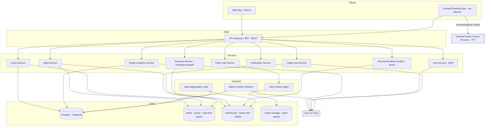
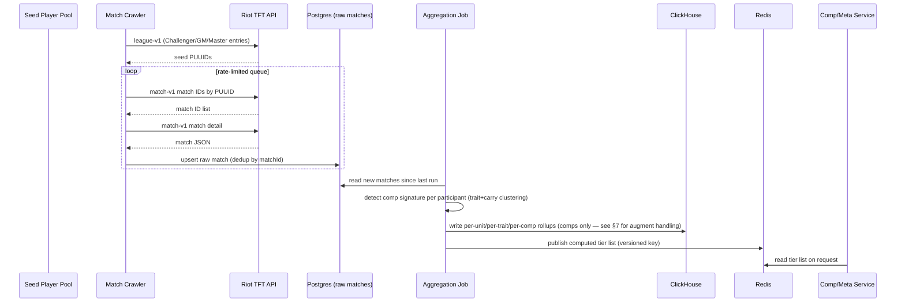
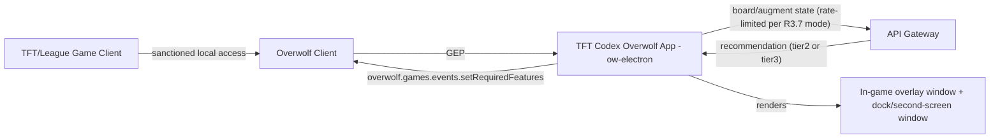
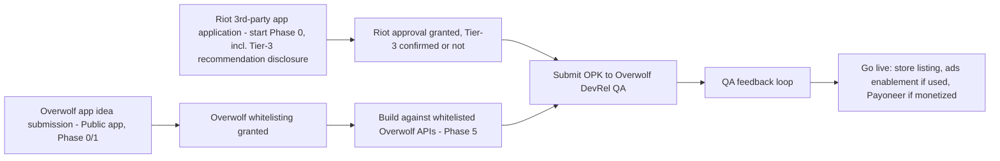

# TFT Codex — Design

Companion to `requirements.md`. Every major design decision below is traceable to a requirement ID (e.g. `[R1]`). **v2:** mobile removed; overlay redesigned around the Overwolf platform instead of a standalone Tauri shell. **v3:** §8 revised to add the Tier-1/2/3 recommendation-timing compliance model (`[R3.7]`, see `review-and-roadmap.md` §1); new endpoints for Requirements 14–19; visual/UI design tokens now live in the companion `design-system.md` rather than here — this document stays architecture-only.

## 1. Goals & Non-Goals

**Goals**

- A meta engine that computes its own rankings from real match data — the product's core differentiator over hand-curated tier lists. `[R1]`
- Ship a genuinely useful web MVP fast, then layer personalization, a builder, and the Overwolf overlay without re-architecting. `[R1–R6]`
- Stay inside Riot's API rate limits, Riot's TFT display restrictions, Riot's real-time-recommendation restrictions (`[R3.7]`), and Overwolf's Third-Party Application/publishing rules at every layer. `[R3, R12, R13]`

**Non-Goals (for this version of the design)**

- No full combat simulator / damage calculator — the sandbox (R6) gives a rough tankiness/damage _estimate_, not a fight simulator.
- No native mobile app. Web is responsive and usable on mobile browsers (R10.1), but there is no App/Play Store submission in this scope.
- No real-money transactions, cosmetics, or coaching marketplace on web. On the Overwolf build specifically, monetization is Overwolf Ads/Subscriptions only if enabled at all (R13.3) — not a design detail we control. Web's own monetization (display ads / optional paid tier) is covered under R18, separate from the Overwolf constraint.
- No support for game modes outside ranked/normal Standard TFT at launch (Hyper Roll, Double Up can be added later using the same GEP integration — Overwolf's TFT event data already distinguishes Hyper Roll via queueID 1130).
- No live, continuous opponent-board tracking during a match, at any tier (`[R14.3]`) — lobby intel (R14) is a one-shot, pre-combat lookup only, not a scouting feature.

---

## 2. High-Level Architecture



**Why this shape:**

- A single **API Gateway / BFF** in front of internal services keeps client apps simple and gives one place to enforce auth, caching headers, rate-limit accounting, and — critically — the augment-compliance filter described in §7 `[R3, R11.5, R12.2]`.
- **ClickHouse (or Timescale as a lighter alternative)** handles the OLAP-style rollups (avg placement, top-4 rate by comp/patch/day) that Postgres handles poorly at match-history scale; Postgres stays the source of truth for entities (comps, users, patches) `[R1.1–1.3]`.
- **Match Crawler Workers** are separate from the request path entirely — tier-list computation must never be blocked by or block live API traffic `[R1.2, R11.1]`.
- The **Overwolf app talks to Overwolf's Game Events Provider**, not a homegrown local-API poller. Overwolf already handles the sanctioned, Riot-approved mechanism for reading live TFT state (augment picks, bench items, round/stage, star levels); reimplementing that ourselves would be redundant, riskier from a compliance standpoint, and strictly worse data than what GEP already exposes for TFT specifically. `[R5.2, R12.4, R13]`
- A new **Lobby Intel Service** (`[R14]`) is deliberately separate from the Recommendation Engine — it runs exactly once per match at loading-screen detection, queries Riot's API for each visible participant's public match history, caches the result, and never touches GEP's live in-match event stream. Keeping it structurally isolated from `REC` makes it easy to demonstrate to Riot's reviewers that it can't drift into live opponent tracking.

---

## 3. Data Pipeline (Meta Engine)



**Comp-detection algorithm (v1, rules-based):**

1. For each participant's final board, compute active traits at their highest breakpoint and total unit cost distribution.
2. Compare against a maintained registry of "named comp signatures" (core trait pair + designated carry unit) for the current patch, seeded manually each patch by a data/product owner and refined by clustering outliers.
3. Unmatched boards are grouped by an unsupervised clustering pass (k-means over trait-vector + carry) each run; clusters that cross a minimum play-rate threshold are surfaced to the editorial queue as new-comp candidates rather than auto-published. This keeps `[R1.3]`'s "documented composite score" honest — no comp gets a tier until a human confirms its signature, but the _stats_ backing it are 100% computed.

**Tier assignment formula (documented, versioned, and shown to users on request):**

```
score = (0.45 × top4_rate_norm) + (0.35 × avg_placement_norm) + (0.20 × play_rate_norm)
tier  = S if score ≥ p90, A if ≥ p70, B if ≥ p45, C otherwise
```

Percentile thresholds are recomputed per patch so tiers stay relative to the current patch's own distribution, not a fixed historical bar. This formula applies to **comps only**. Augments use a deliberately different, opaque-to-the-user scoring path — see §7. `[R1.3, R1.4, R3]`

**Rate-limit management `[R12.2]`:** the crawler runs behind a Redis-backed token-bucket queue sized to the app's Riot API key tier. Backfill crawling and live refresh crawling use separate queue lanes so a backfill job can never starve the 30-minute refresh SLA in `[R1.2]`. The Lobby Intel Service (§2, `[R14]`) draws from the same token-bucket budget under its own lane — size this lane for up to 7 extra participant lookups per linked-user match, since it fires synchronously at loading-screen time and can't wait behind backfill traffic.

---

## 4. Core Data Models

```typescript
interface Champion {
  id: string; // e.g. "TFT17_Zoe"
  name: string;
  cost: 1 | 2 | 3 | 4 | 5;
  traits: string[]; // trait ids
  patch: string;
}

interface Trait {
  id: string;
  name: string;
  type: 'origin' | 'class';
  breakpoints: number[]; // e.g. [2,4,6,8]
}

interface Item {
  id: string;
  name: string;
  components: [string, string] | null; // null for basic components
  tags: string[]; // e.g. ["AD","tank","aura"]
}

// NOTE: deliberately has NO winRate or avgPlacement fields.
// This is not an oversight — see §7. Any future field addition to
// this interface must be checked against Requirement 3.1 before merging.
interface Augment {
  id: string;
  name: string;
  tier: 'S' | 'A' | 'B' | 'C'; // categorical only, see §7
  playRate: number; // explicitly allowed per R3.3
  roundsOffered: (2 | 3 | 4)[];
  description: string;
  patch: string;
}

// Server-side only. Never serialized in any API response, ever.
// Exists purely to feed the recommendation engine's internal ranking.
interface AugmentInternalStats {
  augmentId: string;
  compId: string | null;
  avgPlacement: number;
  winRate: number;
  sampleSize: number;
}

interface Comp {
  id: string;
  name: string;
  altName?: string;
  patch: string;
  tier: 'S' | 'A' | 'B' | 'C' | 'provisional';
  trend: 'rising' | 'falling' | 'stable';
  playstyle: 'Reroll' | 'Fast 8' | 'Fast 9' | 'Slow Roll' | 'Standard';
  difficulty: 'Easy' | 'Medium' | 'Hard';
  coreTraits: string[];
  carries: string[]; // champion ids
  units: {
    championId: string;
    role: 'carry' | 'tank' | 'support';
    starTarget: 1 | 2 | 3;
    items: string[]; // item ids, ordered by priority
  }[];
  formation: { front: string[]; back: string[] };
  augmentPriority: string[]; // ordered category labels, e.g. ["Items","Combat","Econ"]
  curatedAugments: string[]; // augment ids that suit this comp — editorially curated, not win-rate ranked
  explanation: string; // "why it works" copy
  stageGuides: { stage2: string; stage3: string; stage4: string };
  computedStats: {
    avgPlacement: number;
    top4Rate: number;
    winRate: number;
    playRate: number;
    sampleSize: number;
    computedAt: string; // ISO timestamp
  };
}

interface PatchVersion {
  id: string; // "17.9"
  setNumber: number;
  setName: string;
  releaseDate: string;
  isCurrentPatch: boolean;
  balanceChanges: {
    entityType: 'champion' | 'trait' | 'item' | 'augment';
    entityId: string;
    summary: string;
  }[];
  metaImpactSummary: string | null; // null until editorially approved [R8.2]
}

interface PlayerProfile {
  puuid: string; // primary key, from Riot RSO
  region: string;
  riotId: string; // "Name#TAG"
  linkedAt: string;
  lastSyncedAt: string | null;
  notificationPrefs: {
    channel: 'email' | 'webpush' | 'overwolf-native';
    category: 'patch' | 'bookmarkedComp' | 'bookmarkedChampion';
    enabled: boolean;
  }[];
}

interface MatchSummary {
  matchId: string;
  puuid: string;
  patch: string;
  placement: number; // 1-8
  detectedCompId: string | null;
  augmentsPicked: string[]; // ids only — no placement/outcome ever joined to this in any exposed view, see R4.7
  levelCurve: { round: string; level: number }[];
  goldCurve: { round: string; gold: number }[];
  timestamp: string;
}

// [R14] One-shot, pre-combat only — never refreshed mid-match. See §2's Lobby Intel Service note.
interface LobbyIntelEntry {
  puuid: string;
  riotId: string;
  recentAvgPlacement: number;
  mostPlayedComps: string[]; // comp ids, top 3
  rankTier: string | null;
  computedAt: string; // ISO timestamp — set once at loading-screen detection
}

interface RecommendationRequest {
  boardUnits: string[]; // champion ids currently on board/bench
  goldAvailable: number;
  level: number;
  augmentOptions?: string[]; // present only when requesting augment advice
  source: 'web' | 'overwolf-overlay';
  mode: 'tier2-lookup' | 'tier3-adaptive'; // [R3.7] server rejects tier3-adaptive unless the Riot-confirmation flag is set for this deployment
}

interface RecommendationResponse {
  suggestedComps: { compId: string; matchScore: number; missingUnits: string[] }[];
  augmentAdvice?: { augmentId: string; rank: number; reason: string }[]; // reason is always qualitative text, never numeric stats
  contextAware: boolean; // false if fell back to global tier list [R3.5], also false whenever mode is tier2-lookup
  modeServed: 'tier2-lookup' | 'tier3-adaptive'; // [R3.7] always echoed back so clients can label the UI correctly if a tier3 request was downgraded
}
```

---

## 5. API Design (REST, versioned under `/v1`)

| Endpoint                          | Method     | Purpose                                                                                                                                                    | Req.         |
| --------------------------------- | ---------- | ---------------------------------------------------------------------------------------------------------------------------------------------------------- | ------------ |
| `/v1/meta/tier-list`              | GET        | Tier list, filterable by `patch`, `tier`, `playstyle`, `difficulty`                                                                                        | R1           |
| `/v1/comps`                       | GET        | Search/filter comps by name/carry/trait                                                                                                                    | R2           |
| `/v1/comps/:id`                   | GET        | Full comp detail                                                                                                                                           | R2           |
| `/v1/augments/tier-list`          | GET        | Global augment tier list — **response type has no winRate/avgPlacement fields**                                                                            | R3           |
| `/v1/augments/:id`                | GET        | Augment detail incl. per-comp curated fit — same field restriction                                                                                         | R3           |
| `/v1/recommendations`             | POST       | Board-state-aware comp/augment recommendation; `mode` field selects Tier-2 vs Tier-3, server enforces the R3.7 gate regardless of what the client requests | R3, R5, R3.7 |
| `/v1/lobby/intel`                 | GET        | One-shot pre-combat lobby participant lookup for the current match, cached                                                                                 | R14          |
| `/v1/items/optimize`              | POST       | Multi-carry itemization suggestion given held components + board (builder/pre-post-game use; Tier-1 only per R16.3)                                        | R16          |
| `/v1/reference/breakpoints`       | GET        | Static XP/gold breakpoint table for the current patch                                                                                                      | R17          |
| `/v1/matches/:matchId/coaching`   | GET        | Post-game AI coaching narrative for a reviewed match                                                                                                       | R15          |
| `/v1/auth/riot/start`             | GET        | Begin RSO OAuth flow                                                                                                                                       | R7           |
| `/v1/auth/riot/callback`          | GET        | RSO OAuth callback                                                                                                                                         | R7           |
| `/v1/players/me`                  | GET/DELETE | Current linked profile / unlink+delete                                                                                                                     | R7           |
| `/v1/players/me/matches`          | GET        | Paginated match history                                                                                                                                    | R4           |
| `/v1/players/me/matches/:matchId` | GET        | Single match review vs. comp baseline                                                                                                                      | R4           |
| `/v1/players/me/analytics`        | GET        | Aggregated personal dashboard data                                                                                                                         | R4           |
| `/v1/builder/comps`               | POST/GET   | Save/list user-built comps                                                                                                                                 | R6           |
| `/v1/builder/comps/:id`           | GET        | Load a saved/shared comp                                                                                                                                   | R6           |
| `/v1/patches`                     | GET        | Patch history list                                                                                                                                         | R8           |
| `/v1/patches/latest`              | GET        | Latest patch + meta impact summary                                                                                                                         | R8           |
| `/v1/notifications/prefs`         | GET/PUT    | Manage notification subscriptions                                                                                                                          | R9           |

All `GET` endpoints under `/v1/meta`, `/v1/comps`, `/v1/augments`, `/v1/patches`, `/v1/reference` are cached at the gateway (Redis, TTL aligned to the 30-minute refresh SLA) and require no auth — the product must be fully useful logged out `[R7.4]`. The gateway applies a **response schema allowlist** on `/v1/augments/*` specifically, stripping any field not in the compliant `Augment` type even if a future bug introduces one upstream — belt-and-suspenders for R3.1. The gateway applies a second, separate enforcement rule on `/v1/recommendations`: any request with `mode: "tier3-adaptive"` is silently downgraded to `tier2-lookup` server-side unless a deployment-level "Riot confirmed" flag is set (`[R3.7]`) — this is a server-side kill switch, not a client-side toggle, so no client build can accidentally ship Tier-3 behavior ahead of approval.

---

## 6. Overwolf Desktop App Architecture (Phase 5)



**Framework choice: Overwolf Electron (`ow-electron`), not Overwolf Native.** Overwolf offers two build paths: "Native" apps (plain HTML/CSS/JS in Overwolf's own lightweight container, with real restrictions — no full component libraries like Vuetify, mouse-event quirks in non-native windows) and **Overwolf Electron**, Overwolf's maintained Electron distribution built for exactly this use case. `ow-electron` lets us ship the same React component library and design tokens used on web (`[R10.2]`, tokens defined in `design-system.md`), which Native would fight us on. The trade-off is a heavier runtime than a from-scratch Tauri app — acceptable here since Overwolf's own client is already resident in memory for any Overwolf user, so we're not adding a second unrelated framework's footprint on top of nothing.

**Game data: GEP, not Live Client Data API.** Overwolf's TFT Game Events Provider already exposes exactly what an overlay needs — augment picks, `match_info` (round/stage, in-progress state), bench items per player, champion star levels, and `game_mode` — through `overwolf.games.events`. TFT shares a Game ID with League of Legends (since TFT runs inside the League client), so the app distinguishes a TFT session by watching the LoL Launcher's `lobby_info` for `queueId` 1090/1100 (TFT) or 1130 (Hyper Roll) before activating TFT-specific UI `[R5.3]`. `setRequiredFeatures()` is called immediately on game launch, per Overwolf's guidance that late registration risks missed events.

**Window model:** a primary transparent, click-through-toggle in-game overlay window, plus a persistent dock/taskbar window (Overwolf's public-app requirement: at least one visibly-running window at all times, `[R5.6]`). Because Overwolf's own QA process explicitly tests "second screen" usage, the layout is built mobile-first-style — legible and fully functional at a narrow width — so moving it to a secondary monitor at a smaller size doesn't break it `[R5.7]`. A separate streamer-safe display variant (`[R19]`) reuses the same window model with account-identifying elements hidden and larger type.

**Compliance is structural, not a UI choice:** the overlay calls the same `/v1/recommendations` and `/v1/augments/*` endpoints as web, which — per §5 — cannot return win rate or placement data for augments no matter what client asks, and cannot serve Tier-3 adaptive recommendations unless the server-side confirmation flag is set (`[R3.7]`). The overlay can't accidentally violate R3 because the data literally isn't in the response, and it can't accidentally violate the real-time-recommendation restriction because the server, not the client, decides which mode actually gets served.

---

## 7. Augment Compliance Design (Requirement 3)

This gets its own section because it's a hard blocker for Riot approval, not a nice-to-have, and it touches the pipeline, the API, and both clients.

1. **Pipeline:** the aggregation job (§3) still computes `AugmentInternalStats` (win rate, avg placement per augment/comp pairing) — that data is genuinely useful for _ranking_, we just never show the numbers. It's written to a ClickHouse table that the public API layer has no route to at all (not "filtered," structurally unreachable from the gateway's service credentials).
2. **Tier assignment:** augments get a categorical S/A/B/C using the same percentile logic as comps, computed from `AugmentInternalStats`, but only the letter is written to the public `Augment` record.
3. **Recommendation engine:** when ranking augment options for R3.4, the engine reads `AugmentInternalStats` server-side to decide the order, then generates a **qualitative** reason string from a template bank (e.g., "strengthens your current front line," "your board doesn't have the trait count to use this yet") — never a number derived from placement/win rate. This ranking step runs identically whether the request is Tier-2 or Tier-3 (§8) — the _numbers_ restriction (R3.1) and the _real-time-reactivity_ restriction (R3.7) are separate compliance dimensions, and both apply regardless of which one a given feature happens to trip.
4. **Defense in depth:** the API gateway's response schema allowlist (§5) is the last line of defense if a future engineer adds a field to the wrong type by mistake.
5. **Legends:** if a future Set reintroduces Legends, the same `AugmentInternalStats`-style shadow table and template-reason approach applies before any Legend-related feature ships — R3.6 exists so this isn't forgotten.

---

## 8. Recommendation Engine (v1 → v2) — Tiered for Compliance `[R3.7]`

Riot's TFT developer policy restricts two _different_ things that this spec originally conflated: (a) showing augment win-rate/placement numbers (R3.1–3.6, §7 above), and (b) recommendations that "adjust in real time based on the player's actions in game and give direct prescriptions of what to do," plus suggestions "based on the player's current game state" more generally. The engine below is split into two modes so (b) is handled with the same structural rigor §7 already gives (a).

**Tier-2 mode (default, ships without any additional Riot confirmation):**
Given the augment options actually offered this round, look up each one's precomputed categorical tier (§7) and play rate, and return them ranked — this is a filter over static, patch-level data by the options presented, not a function of the player's board. For comp matching, this mode computes "closest matching comp" only when the user explicitly opens/refreshes the panel, using the board state at that instant — a snapshot, not a continuous reactive stream (`[R5.4, R5.5]` in Tier-2 mode).

**Tier-3 mode (adaptive, gated):**
Given a live board state, compute a match score against each tracked comp = (units already on board that belong to the comp) / (comp's total core unit count), weighted by trait breakpoints already hit. Return top 3 by score, tie-broken by the comp's current tier rank, updating continuously as board/bench state changes (`[R5.4]`'s 2-second SLA applies only in this mode). Augment advice looks up the offered augment IDs' per-comp `AugmentInternalStats` row for the best-matching _live_ comp, ranks by expected placement delta **internally**, and returns only the rank + a templated qualitative reason. **This mode SHALL NOT be enabled in any public build until Requirement 3.7's Riot-confirmation flag is set** — see `/v1/recommendations`'s server-side enforcement in §5.

**v2 (future, not in initial phases): learned ranking model.**
Once enough personal + aggregate match data exists, replace the internal score function with a gradient-boosted ranking model trained on (board state, augment options, outcome) tuples, keeping the same request/response contract in `RecommendationResponse` — and the same "numbers never leave the server" and "Tier-3 requires confirmation" rules — so clients don't need to change and compliance doesn't need re-litigating.

---

## 9. Error Handling & Resilience

| Failure                                                                     | Behavior                                                                                                                                                                | Req.        |
| --------------------------------------------------------------------------- | ----------------------------------------------------------------------------------------------------------------------------------------------------------------------- | ----------- |
| Riot API down/rate-limited                                                  | Serve last cached tier list/comp data; show staleness banner                                                                                                            | R1.6, R11.2 |
| Aggregation job fails mid-run                                               | Job is idempotent (upsert by matchId, versioned cache keys); partial failure doesn't publish a partial tier list — the old version stays live until a full run succeeds | R1.2        |
| RSO OAuth failure                                                           | Return to previous screen with a plain-language retry prompt; no partial profile is created                                                                             | R7.1        |
| GEP not yet registered / no data                                            | Overlay shows "waiting for game data" state, retries silently in background                                                                                             | R5.9        |
| Recommendation engine has no confident match                                | Falls back to global tier list, `contextAware: false` flag set so UI can label it                                                                                       | R3.5        |
| Tier-3 mode requested but confirmation flag not set                         | Gateway silently serves Tier-2 instead, `modeServed` reflects the downgrade so the client can label the response correctly rather than erroring                         | R3.7        |
| Riot API unavailable for a specific lobby participant during loading screen | Lobby Intel panel renders that participant as "no recent data" rather than blocking the rest of the panel                                                               | R14.1       |

---

## 10. Security & Privacy

- Auth: RSO OAuth 2.0 only; no password storage `[R7.1]`. Session tokens are short-lived JWTs; refresh tokens stored server-side, never in client localStorage or the Overwolf app's local storage.
- PII minimization: only PUUID, region, and display Riot ID are persisted `[R7.2]`. Match data used for personal analytics is scoped to the linked user's own PUUID for write access; other participants' data in a shared match is used only in-memory for comp detection/comparison, never persisted against their identity. Lobby Intel (`[R14]`) is the one place other participants' public match history is read at all — it is fetched fresh per match, cached briefly, and never written to a durable store tied to their identity.
- Deletion: unlink triggers a hard-delete job for the profile and derived analytics rows within 30 days, logged for compliance audit `[R7.3, R12.4]`.
- Rate-limit and API-key secrets live in a secrets manager, never in client bundles or the Overwolf app package; all Riot API calls are server-side only.
- Shared session between web and Overwolf `[R7.5]` is implemented via the same JWT issuer; the Overwolf app never re-implements or bypasses RSO.

---

## 11. Testing Strategy

| Layer                            | Approach                                                                                                                                                                                                                |
| -------------------------------- | ----------------------------------------------------------------------------------------------------------------------------------------------------------------------------------------------------------------------- |
| Aggregation logic                | Unit tests against fixture match JSON with known expected rollups; golden-file regression tests per patch schema change                                                                                                 |
| Riot API client                  | Contract tests against recorded fixtures (VCR-style cassettes) so tests don't burn real rate limit; a small nightly job hits the real sandbox to catch schema drift                                                     |
| Augment compliance               | A dedicated test suite that asserts `winRate`/`avgPlacement` never appear in any `/v1/augments/*` or `/v1/recommendations` response body, run on every PR — this is a release-blocking check, not a nice-to-have        |
| Recommendation-timing compliance | A companion test suite asserting `/v1/recommendations` never serves `modeServed: "tier3-adaptive"` unless the deployment's Riot-confirmation flag is explicitly set in test config — also release-blocking `[R3.7]`     |
| API endpoints                    | Integration tests (Supertest or equivalent) covering cache-hit/miss, auth-required vs. public routes, and the stale-data fallback path                                                                                  |
| Recommendation engine            | Deterministic unit tests on both the Tier-2 lookup function and the Tier-3 scoring function with hand-built board states and expected rankings                                                                          |
| Frontend components              | Component tests (React Testing Library) for tier list filtering, comp modal rendering, builder trait-count logic — shared between web and the Overwolf app where components are shared                                  |
| End-to-end (web)                 | Playwright flows: browse tier list → open comp → (logged in) review a match → bookmark a comp → receive notification pref saved                                                                                         |
| Overwolf app                     | Manual QA checklist per release mirroring Overwolf's own DevRel review (documented in `tasks.md` 5.x): hotkey accessibility, multi-resolution/second-screen legibility, GEP registration timing, idle CPU/RAM profiling |
| Data accuracy                    | Weekly spot-check job comparing a sample of computed comp stats against an independent manual recount from raw match rows, alerting on divergence beyond a tolerance                                                    |

---

## 12. Overwolf & Riot Publishing Pipeline

This runs partly in parallel with engineering, not after it — both approvals have real lead time.



Key constraints this drives into `tasks.md`:

- Riot's third-party approval (R13.1) and Overwolf's app-idea whitelisting (R13.2) are both **prerequisites**, not launch-week tasks — Overwolf explicitly will not grant API access pre-whitelisting, and will ask for proof of Riot approval before publication even if the app doesn't call Riot's API directly.
- The Riot approval application should explicitly describe the Tier-3 adaptive recommendation behavior (§8) and ask for a direct answer, so the team knows before Phase 5 starts building whether Tier-3 is buildable at all, rather than finding out at submission time.
- The Overwolf build must be a "Public" app from day one of that submission (Overwolf doesn't approve private apps), which means committing to a monetization plan (even if "ads disabled at launch") at submission time `[R13.2, R13.3]`.
- QA explicitly checks hotkey access, resolution handling, and second-screen support — these are in `requirements.md` (5.6, 5.7) because Overwolf will reject a submission missing them, not because we invented them.

---

## 13. Tech Stack Summary

| Layer                              | Choice                                                       | Rationale                                                                                                                            |
| ---------------------------------- | ------------------------------------------------------------ | ------------------------------------------------------------------------------------------------------------------------------------ |
| Web frontend                       | Next.js (React, TypeScript)                                  | SSR for fast first paint on the public tier list; shares types with backend and the Overwolf app                                     |
| Overwolf app                       | Overwolf Electron (`ow-electron`)                            | Reuses the React component library and design tokens (`design-system.md`) from web; avoids Overwolf Native's UI-library restrictions |
| API layer                          | Node.js/TypeScript (NestJS or Fastify)                       | Type-sharing with both frontend clients via a shared package; strong ecosystem for queues/workers                                    |
| Relational store                   | PostgreSQL                                                   | Source of truth for entities, users, saved comps                                                                                     |
| OLAP store                         | ClickHouse (or Timescale if team prefers Postgres-only ops)  | Fast aggregate rollups over large match volumes; also hosts the gateway-unreachable augment-stats table from §7                      |
| Cache/queue                        | Redis                                                        | Tier-list cache, rate-limit token bucket, job queue backing, Lobby Intel cache `[R14.4]`                                             |
| Object storage                     | S3-compatible                                                | Patch note assets, exported reports                                                                                                  |
| Overwolf monetization (if enabled) | Overwolf Ads SDK / Overwolf Subscriptions only               | Overwolf approves no third-party monetization in the Overwolf build `[R13.3]` — this does not constrain the web app                  |
| Web monetization                   | Standard web ad network (free tier) + optional paid tier     | Independent of the Overwolf constraint above; see `[R18]`                                                                            |
| Infra                              | Docker + a managed container platform (e.g., ECS/Fly/Render) | Keeps ops simple for a small team; not locked to one cloud in this design                                                            |
| CI                                 | GitHub Actions                                               | Lint/test/build gates on every PR, including the augment-compliance and recommendation-timing-compliance test suites from §11        |

---

## 14. Visual Design System

Colors, typography, spacing, component patterns, motion, and accessibility rules live in the companion `design-system.md` rather than here, so this document stays focused on architecture. The two are linked structurally: `packages/ui`'s tokens (`[R10.2]`) are generated from `design-system.md`'s token file, and every new component built against this architecture should be checked against that document before it ships.
